# Deliverable 5A: Translation Feature Refactoring Documentation

## 1. Overview
The primary objective of this deliverable was to refactor and implement a robust, accessible, and modular translation feature for the Apache Roller project. The new implementation allows users to seamlessly translate weblog entries and content listings into multiple target languages (with support for over 20 languages) using interchangeable translation providers.

Careful attention was paid to architectural purity, design patterns, fault tolerance, and separation of concerns. The feature is primarily divided into a business service layer, multiple translation provider adapters, a decorator-based rendering layer, and user interface elements injected into existing themes.

---

## 2. Architecture & Design Patterns

The translation feature relies on a clean architecture incorporating several structural and behavioral design patterns to guarantee extensibility and maintainability.

### 2.0. Architecture Diagram

```mermaid
classDiagram
    %% Decorator Pattern
    class PageModel {
        <<interface>>
        +getWeblogEntry() WeblogEntry
        +getWeblogEntriesPager() WeblogEntriesPager
    }
    class TranslatedPageModel {
        <<decorator>>
        -PageModel delegate
        -TranslationService service
        +getWeblogEntry() WeblogEntry
    }
    TranslatedPageModel ..|> PageModel
    
    class WeblogEntry {
        +getTitle() String
        +getText() String
        +getSummary() String
    }
    class TranslatedWeblogEntry {
        <<decorator>>
        -WeblogEntry delegate
        -TranslatableContent translation
        +getTitle() String
    }
    TranslatedWeblogEntry --|> WeblogEntry

    %% Strategy Pattern
    class TranslationProvider {
        <<interface>>
        <<strategy>>
        +translate(TranslationRequest) TranslationResult
        +getName() String
        +supports(Language) boolean
    }
    class MockTranslationProvider {
        <<strategy>>
    }
    class SarvamTranslationProvider {
        <<strategy>>
    }
    class GoogleTranslateProvider {
        <<strategy>>
    }
    class MyMemoryTranslationProvider {
        <<strategy>>
    }
    MockTranslationProvider ..|> TranslationProvider
    SarvamTranslationProvider ..|> TranslationProvider
    GoogleTranslateProvider ..|> TranslationProvider
    MyMemoryTranslationProvider ..|> TranslationProvider

    %% Singleton & Orchestration
    class TranslationService {
        <<interface>>
        <<singleton>>
        +translateEntry(WeblogEntry, Language) TranslatedWeblogEntry
    }
    class TranslationServiceImpl {
        -Map cache
        -TranslationProviderFactory factory
    }
    TranslationServiceImpl ..|> TranslationService
    TranslatedPageModel --> TranslationService : "Calls for translation"
    TranslationServiceImpl --> TranslationProvider : "Delegates to strategy"

    %% Factory Pattern
    class TranslationServiceFactory {
        <<factory>>
        +getTranslationService() TranslationService
    }
    TranslationServiceFactory --> TranslationService : "Constructs singleton"

    class TranslationProviderFactory {
        <<factory>>
        +getProvider(String) TranslationProvider
    }
    TranslationProviderFactory --> TranslationProvider : "Resolves Strategy"
    TranslationServiceImpl --> TranslationProviderFactory : "Uses"

    %% Adapter Pattern
    class ContentMapper {
        <<adapter>>
        +toTranslatableContent(WeblogEntry) TranslatableContent
    }
    TranslationServiceImpl --> ContentMapper : "Adapts model"
    
```



### 2.1. Strategy Pattern
*   **Purpose**: To allow the core application to switch translation backends dynamically without changing its internal logic.
*   **Implementation**: A `TranslationProvider` interface acts as the Strategy contract. `MockTranslationProvider`, `SarvamTranslationProvider`, and `GoogleTranslateProvider` represent the concrete strategies.

### 2.2. Decorator Pattern
*   **Purpose**: To augment the behavior of existing Roller classes strictly within the presentation/rendering layer without modifying the persistence model or the database schema.
*   **Implementation**:
    *   `TranslatedWeblogEntry` decorates `WeblogEntry` to intercept calls to `getTitle()`, `getText()`, and `getSummary()`, seamlessly returning translated text on demand.
    *   `TranslatedPageModel` decorates `PageModel` to inject the active `Language` and `TranslationProvider` contexts derived from request parameters.
    *   `TranslatedWeblogEntriesPager` decorates `WeblogEntriesPager` to intercept listing rendering, ensuring entire lists of blog posts are translated together.

### 2.3. Factory Pattern
*   **Purpose**: To centralize and abstract object creation.
*   **Implementation**: 
    *   `TranslationProviderFactory` maintains a registry of available providers and returns the appropriate implementation based on the `provider` query parameter or system default.
    *   `TranslationServiceFactory` encapsulates the logic to provide the active singleton `TranslationService`.

### 2.4. Adapter Pattern
*   **Purpose**: To decouple the translation providers from the Roller-specific `WeblogEntry` persistence object.
*   **Implementation**: `ContentMapper` adapts the heavy `WeblogEntry` entity into a lightweight, framework-agnostic `TranslatableContent` DTO.

### 2.5. Singleton Pattern
*   **Purpose**: To manage unified application state, particularly the translation cache.
*   **Implementation**: `TranslationServiceFactory` initializes and returns a single `TranslationServiceImpl` instance.

---

## 3. Core Domain & Interfaces

The core domain resides within `org.apache.roller.weblogger.business.translation`.

### 3.1. Enums and DTOs
1.  **`Language.java`**:
    *   An Enum containing all supported languages formatted with their ISO-639-1 localized short codes (e.g., `en`, `hi`, `fr`, `te`).
    *   Provides mapping logic (`fromCode`) that cleanly normalizes standard BCP-47 identifiers back to baseline enums.
2.  **`TranslatableContent.java`**:
    *   A Data Transfer Object (DTO) containing `title`, `text`, and `summary`.
3.  **`TranslationRequest.java`**:
    *   Encapsulates an impending translation operation. Contains the source `TranslatableContent`, source `Language`, target `Language`, and the field's content type (HTML vs plain text).
4.  **`TranslationResult.java`**:
    *   Encapsulates the outcome of a translation block. Contains the modified `TranslatableContent`, the `providerName` utilized, a boolean `success` flag, and diagnostic `errorMessage` data.
5.  **`TranslationException.java`**:
    *   A generic unchecked exception used across the orchestration bounds.

### 3.2. Interfaces
1.  **`TranslationProvider.java`**:
    *   `translate(TranslationRequest request)`: Executes the conversion logic.
    *   `getName()`: Returns the canonical name (e.g., `SarvamProvider`).
    *   `supports(Language language)`: Indicates if the target platform accepts a specific language syntax.
2.  **`TranslationService.java`**:
    *   Defines the orchestrator flow `translateEntry(WeblogEntry, Language)` and `translateEntry(WeblogEntry, Language, String providerName)`.

---

## 4. Service Orchestration Layer

**`TranslationServiceImpl.java`** acts as the primary orchestrator binding the entire pipeline together:
*   **In-Memory Cache**: Uses `ConcurrentHashMap<String, TranslationResult>` to cache successful api queries permanently based on `entryId:langCode:providerName`. This safely limits external network calls within the highly concurrent Jetty Web framework.
*   **Short-Circuiting**: Bypasses the network entirely if the calculated source language is strictly equal to the target language via `LanguageValidator`.
*   **Fault Tolerance**: In the event a translation request throws an unhandled exception or times out, the Service gracefully defaults back to the original content, preventing cascade failures into the DOM.

**Utilities**:
*   `LanguageValidator.java` resolves locales smoothly (fallback strategies from post locale, to blog locale, to English defaults).
*   `ContentMapper.java` binds and maps data in/out of the `WeblogEntry`.
*   `HttpHelper.java` manages safe JSON extraction and network fetching logic shared across external HTTP providers.

---

## 5. Concrete Providers Implemented

### 5.1. Sarvam AI Provider (`SarvamTranslationProvider.java`)
*   **Mechanism**: Issues synchronous `java.net.http.HttpClient` HTTP POST requests to `https://api.sarvam.ai/translate`.
*   **Mapping**: Translates internal ISO-639-1 codes into Sarvam's mandated BCP-47 format (`hi-IN`).
*   **Authentication**: Pulls `translation.sarvam.api.key` from properties directly using the `WebloggerConfig` properties file.
*   **Payload Construction**: Automatically parses response strings and injects the extracted `translated_text` array indices into the localized attributes.

### 5.2. Google Translate Provider (`GoogleTranslateProvider.java`)
*   **Mechanism**: Targets the unauthenticated public GTX network endpoint utilized by native Google extensions: `https://translate.googleapis.com/translate_a/single`.
*   **Mapping**: Supports standard ISO short codes out of the box.
*   **Payload Parsing**: Interprets the multidimensional nested JSON arrays returned by the GTX interface, recursively appending and building the translated blocks gracefully.

### 5.3. Mock Provider (`MockTranslationProvider.java`)
*   **Mechanism**: Fully isolated sandbox logic for local unit testing and diagnostics.
*   **Mapping**: Supports all arguments limitlessly by skipping API execution.
*   **Output**: Conditionally prefixes the source text safely with the calculated `[TARGET_CODE]`, ensuring correct deterministic responses in Unit Tests.

### 5.4. MyMemory Provider (`MyMemoryTranslationProvider.java`)
*   **Mechanism**: Issues HTTP GET requests to the `mymemory.translated.net` API endpoint.
*   **Mapping**: Maps to ISO-639-1 language codes.
*   **Use Case**: Pluggable free-tier alternative that safely manages limited requests up to 500 words per day without hardcoded API keys.

---

## 6. Rendering & View Lifecycle Integration

To effectively hook into the Roller application context, modifications were introduced directly to the View mapping components:

### 6.1. Custom Page Models
*   **`roller-custom.properties`** was explicitly amended to assign the overridden page logic:
    ```properties
    rendering.pageModelClass=org.apache.roller.weblogger.ui.rendering.model.TranslatedPageModel
    translation.provider.default=SarvamProvider
    translation.sarvam.api.key=YOUR_API_KEY
    ```
*   **`TranslatedPageModel.java`**: Extracts HTTP Request URL bounds (`?lang=X&provider=Y`). When an environment calls `getWeblogEntry()` or `getWeblogEntriesPager()`, it delegates the native entries to the translation wrappers directly.

---

## 7. UI Theme Manipulations

Both the default and customized site templates were modified to render visual controls for the user base:

### 7.1. Gaurav Theme
*   **New Template `translation_bar.vm`**: Created a responsive UI toolbar composed entirely of vanilla CSS and semantic UI attributes. Uses embedded Javascript to dynamically append the `&lang=` parameters onto `window.location.search` selectively.
*   **Modifications**: Bound the element inside `std_header.vm`, allowing it to persist globally across all views inside the theme format. Also modified `theme.xml` to officially register the new `translation_bar` template into the Roller rendering scope.

### 7.2. Basic Theme
*   **Modifications**: Embedded a localized sidebar widget natively directly inside `sidebar.vm`. Uses simple static HTML bounds and velocity interpolation to construct direct linkage hrefs for rapid language swapping.

---

## 8. Unit Testing and Build Confidence

### 8.1. Added Unit Tests (`TranslationServiceTest.java`)
*   Bootstrapped isolated Unit Tests using JUnit Jupiter to systematically assert:
    *   The singleton implementation validates symmetrically (`assertNotNull`).
    *   Language validation and short-code derivations evaluate logically (`Language.fromCode("hi-IN") -> HINDI`).
    *   The orchestration correctly delegates to the explicit `MockProvider`, and appropriately validates the output string format matching (`assertEquals("[HI] Title")`).

### 8.2. Infrastructure Diagnostics
*   Corrected the local maven test hierarchy by strictly isolating Derby Database port hooks (`4224`). Ensures that concurrent `mvn jetty:run` background Daemons no longer restrict database locking operations, culminating in a 100% successful test success rate (`161 Tests Passed`).
